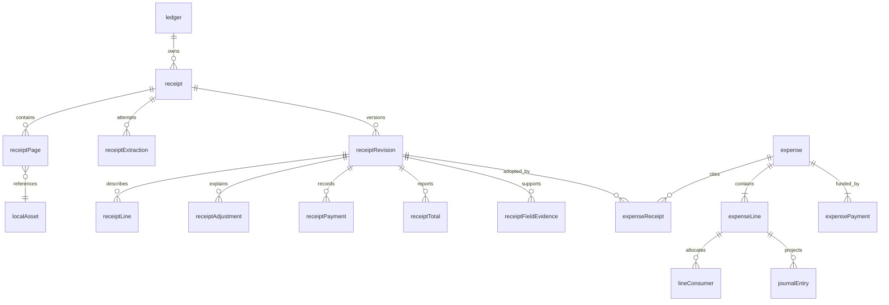

# 小票凭证数据模型设计

日期：2026-09-23。状态：建议稿，供 PR 评审；本次只新增文档，不创建数据库表或修改运行时代码。

本设计以 [本地数据模型 Spec](../superpowers/specs/2026-09-23-local-schema-design.md) 和当前 [v1 migration](../../Packages/LedgerKit/Sources/LedgerPersistence/Migrations.swift) 为基础，扩展原计划 M3 / M4 的 Receipt 能力。既有 `participant / member`、`expenseLine / lineConsumer / expensePayment`、`transfer` 与 journal 继续使用。此前研究笔记中的 `ExpenseAllocation / Settlement` 是对比时的候选名称，不替换已落地模型。

## 1. 目标与实施边界

小票可能同时包含商品、税率汇总、服务费、折扣、付款明细与找零。只保存商户和总额会丢失后续核对与按商品分账需要的信息；把每个识别数字都加入账单，则可能重复计税或把现金交付误作消费。

建议分三层保存：原始文件与提取证据、结构化凭证修订、已校验的账本事件。Receipt 保存票据表达的内容，Expense 保存当前有效的分账事实，journal 保存由事件推导的金额归属。三层都在本地持久化；AI 只生成候选，不直接写 journal。

V1 保存丰富凭证信息，先完成可靠的总额记账与现有逐行分摊的接入。复杂税基运算、自动复合计税、退款入账、礼品卡归属推断和多币支付自动换算另行实现。识别得到但暂不支持计算的内容仍保留。

这里的「尽可能完整」不表示识别器必须填满全部字段。原文、未知、冲突与不支持的内容均有保存位置，不能靠猜测补齐数据。

## 2. 与现有模型的关系

图省略商户、税组、引用、注释与来源映射表。`receiptRevision` 表示凭证解释的一次完整快照；新修订不会自动修改已有 Expense。

| 已有对象 | 保留语义 | Receipt 扩展的职责 |
| --- | --- | --- |
| participant / member | 承担人 / 账本身份 | 支付卡号或姓名只能作为匹配证据，不能直接成为身份 |
| expense | 总额由行金额求和，不新增可独立修改的 total | 小票上多个 total / subtotal 分别保留，选定后才形成账目 |
| expenseLine | item / tax / service / tip / discount / rounding，均为入账组成行 | 已含税说明、汇总行和找零不自动转成入账行 |
| expensePayment | 同一消费内按 participant 汇总垫付金额 | 原票据可有多个支付渠道、现金交付和找零 |
| lineConsumer | weighted / exact / proportional 的输入 | 凭证内容和用户的分摊意图分开保存 |
| journalTx / journalEntry | 既有确定性过账与余额语义 | 保持唯一的过账入口，识别器不创建这些记录 |
| transfer | 已确定的结算 / 转移事件 | 不把收据 payment 直接转成参与人之间的 transfer |

## 3. 类型、身份和约束约定

- 表名与列名沿用单数 camelCase。下文 `UUID` 对应 SQLite `TEXT`；`?` 表示可空；未注明的字段必填。普通新实体有 `id UUID PRIMARY KEY`，关联表另列联合主键。
- 可修改根实体 `receipt` 使用现有审计列：`createdAt / updatedAt / deletedAt / version / createdBy / updatedBy`。创建人是本机 actor，不是消费参与人。操作任务和设备文件 metadata 是本地运行状态，不预设同步字段。
- 已完成的 Revision 及其子表只追加，含 `createdAt / createdBy`，不原地编辑；子记录随 Receipt 的可见性隐藏。修订内容删除或更正通过新 Revision 表达。完成前的候选保存在提取 payload 中，不暴露半份结构化快照。
- 关联表没有独立版本；与所属修订在一个事务中提交。所有关系启用外键；多态证据路径等无法直接用外键表达的关联由 Domain 校验。
- 时间审计列沿用项目 UTC 表示。票据只印当地日期时，保存原始当地日期与精度，不能假装知道时区或秒数。
- `DecimalText` 是严格解析的十进制 `TEXT`，使用点作小数分隔符，禁止科学记数、NaN、Infinity；解析时限制位数和长度。金额、数量和比率的计算不经过 Double。
- Receipt 提取金额采用 `DecimalText`，允许币种未知、OCR 多出小数等尚未满足入账规则的情况。有效 Expense 金额仍为 `Int64` 最小货币单位，币种小数位由现有 Money 规则确定，不新增账本指数列。
- 转换为 minor unit 前必须验证支持的币种、精度、范围和运算溢出；不能把未知币种通过默认两位小数静默入账。数量 / 计价单价可以比最终付款金额有更高精度。
- NULL 与零不同。已解析值为零时保存 `0`；未知原因通过字段证据的 presence 表达。来源原文不会因数值规范化而丢失。

## 4. 原始资源与提取过程

### 4.1 localAsset

| 字段 | 类型 | 用途 |
| --- | --- | --- |
| id | UUID PK | 稳定资源身份 |
| relativePath | TEXT? UNIQUE | present 时必填，为 App 管理目录内的相对路径；未包含文件可空 |
| mediaType | TEXT | 图片、PDF 或提取结果文件类型 |
| role | TEXT | original / thumbnail / extractionPayload |
| sha256 | TEXT | 校验与重复候选检测；相同内容不自动视为同一消费 |
| byteCount | INTEGER | 非负字节数 |
| pixelWidth / pixelHeight | INTEGER? | 图片有效时为正 |
| availability | TEXT | present / missing / excluded；归档不含原图时可以明确标记 |
| createdAt | DATETIME | 创建时间 |

图片和较大的原始响应作为文件存储，不放进主数据库 BLOB。文件落盘、原子重命名完成后再写 metadata；失败后保留任务状态，启动时清理无引用的临时文件。原图只读保存，缩略图可以重建。

### 4.2 receipt 与 receiptPage

| 表 | 字段与关系 |
| --- | --- |
| receipt | id；ledgerId → ledger；captureSource TEXT（camera / photo / file）；capturedAt DATETIME；currentRevisionId UUID? → receiptRevision；审计列 |
| receiptPage | id；receiptId → receipt；assetId → localAsset；pageIndex INTEGER；sourcePageNumber INTEGER?；rotationDegrees INTEGER；createdAt；createdBy；UNIQUE(receiptId, pageIndex) |

一张凭证可有多页或多张连续照片。`pageIndex` 从 0 开始；PDF 可用 sourcePageNumber 指向文件内页码。currentRevisionId 是当前采用的完整解释版本，初始可以为空。选择该指针时必须验证修订属于本 Receipt。

### 4.3 receiptExtraction

字段：`id`、`receiptId → receipt`、`jobId UUID? → processingJob`、`status TEXT`、`engine TEXT`、`provider TEXT?`、`model TEXT?`、`modelVersion TEXT?`、`promptVersion TEXT?`、`outputSchemaVersion INTEGER`、`inputManifestJSON TEXT`、`rawPayloadAssetId UUID? → localAsset`、`startedAt DATETIME`、`finishedAt DATETIME?`、`errorCode TEXT?`。

status 为 running / succeeded / failed / interrupted。一次尝试一条记录，重试另建尝试；inputManifestJSON 固定记录输入资源 ID、hash、页序与版本。成功状态表示获得可解析输出，不等于已经入账。
原始 OCR / 模型响应可保存在 payload 文件中，坐标可由下节字段证据引用。没有返回精确位置的模型保留位置未知，不伪造框选区域。凭据和请求头不写入 payload。

`input / processingJob` 继续按技术 Spec 管理耐久任务。实现时统一创建任务表与本外键；进程恢复只重启任务，不依据 UI 是否显示过回执决定是否重复记账。

## 5. 结构化凭证快照

### 5.1 receiptRevision

| 字段 | 类型 | 用途 |
| --- | --- | --- |
| id / receiptId | UUID PK / FK | 修订归属 |
| revisionNumber | INTEGER | Receipt 内递增，UNIQUE(receiptId, revisionNumber) |
| supersedesRevisionId | UUID? FK | 基于哪个旧解释修改，同属本 Receipt |
| extractionId | UUID? FK | AI / OCR 来源；人工创建可空 |
| origin | TEXT | extraction / manual / derived |
| documentType | TEXT | sale / refund / invoice / paymentSlip / unknown |
| languageTagsJSON | TEXT | 检出的语言数组 |
| currency | TEXT? | 规范币种候选；不能仅凭符号强行确认 |
| occurredLocalText | TEXT? | 已解析的当地日期时间；原文见证据 |
| occurredPrecision | TEXT | date / minute / second / unknown |
| timeZone / occurredAt | TEXT? / DATETIME? | 有依据才填写；推断要记录来源 |
| reconciliationState | TEXT | unchecked / matched / incomplete / mismatch |
| extensionJSON | TEXT | 版本化扩展字段，默认 `{}` |
| createdAt / createdBy | DATETIME / UUID | 修订创建信息 |

normalized 子表是本修订的结构化事实来源；extensionJSON 只放没有正式字段的内容，不能再放一份可独立修改的 total 或 items。raw payload 是历史证据，不与规范字段形成双写。
重新识别或人工纠正都创建完整新修订，子行分配新的 ID，内部引用在一次事务中重映射。旧 Expense 继续引用旧修订；需要明确执行改账命令才切换。不同修订的行不会因名称相同自动视作同一商品。

### 5.2 receiptMerchant

字段：`id`、`revisionId UNIQUE → receiptRevision`、`originalName TEXT?`、`normalizedName TEXT?`、`branchName TEXT?`、`addressText TEXT?`、`phone TEXT?`、`website TEXT?`、`registrationIdsJSON TEXT`。

商户是票据内的快照，不强制合并成全局 Merchant。registrationIdsJSON 为带 type / jurisdiction / value 的数组；名称、地址或编号不明时保留原文。实际地点解析沿用后续 Place 模块，不能仅凭相同店名合并分店。

### 5.3 receiptLine

| 字段 | 类型 | 用途 |
| --- | --- | --- |
| id / revisionId | UUID PK / FK | 商品行身份 |
| parentLineId | UUID? FK | 套餐、附加项等层级；同修订且不能成环 |
| position | INTEGER | 原文顺序，UNIQUE(revisionId, position) |
| kind | TEXT | product / service / bundle / modifier / return / unknown |
| amountRole | TEXT | component / summary / note / unknown |
| originalName / normalizedName / translatedName | TEXT? | 原文名称、标准名称、翻译 |
| productCode / barcode | TEXT? | 小票出现时保留 |
| quantityDecimal / quantityUnit | DecimalText? / TEXT? | 可表达 0.650 kg |
| unitPriceDecimal / priceUnit | DecimalText? / TEXT? | 可表达每 kg、每 100g 等计价方式 |
| lineAmountDecimal / currency | DecimalText? / TEXT? | 小票打印金额；币种确认前可空 |
| priceBasis | TEXT | gross / net / mixed / unknown |
| extensionJSON | TEXT | 其他行信息 |

只有 component 行才可能参与金额合计；套餐总价和其展示明细不能重复相加。`quantity × unitPrice` 用于核对，商户实际行金额也独立保存。推导缺失行金额时标记 derived，不能伪装成票据原文。

### 5.4 receiptAdjustment 与 receiptAdjustmentTarget

receiptAdjustment 字段：`id`、`revisionId FK`、`kind TEXT`（tax / serviceCharge / tip / discount / rounding / other）、`label TEXT?`、`amountDecimal DecimalText?`、`currency TEXT?`、`rateDecimal DecimalText?`、`baseAmountDecimal DecimalText?`、`inclusion TEXT`（includedInComponents / additive / unknown）、`amountRole TEXT`（component / summary / unknown）、`scope TEXT`（document / selected / unknown）、`sequence INTEGER?`、`taxGroupId UUID? → receiptTaxGroup`、`extensionJSON TEXT`。

- amountDecimal 带符号；折扣通常为负，退货等反向场景保留实际含义。rateDecimal 使用单位比例，例如 10% 规范为 `0.1`，原始百分号文本仍保留。
- inclusion 相对于本修订的 component 商品 / 费用金额，不是「是否包含在最终总额」；最终总额本来就可能包含全部税费。
- 税额摘要属于 summary，不因同样打印了一个金额就重复转成 tax 行。

receiptAdjustmentTarget 字段：`id`、`adjustmentId FK`、`lineId UUID? FK`、`basisAdjustmentId UUID? FK`、`relation TEXT`（appliesTo / basis / includedIn）。lineId 与 basisAdjustmentId 必须恰有一个非空；Domain 限制同修订、禁止重复边和依赖环。用部分唯一索引分别约束 adjustment + line + relation、adjustment + basisAdjustment + relation。

此表能表达只对部分商品打折、税基包含服务费等关系。V1 只保存有证据的关系并核对金额，不执行任意公式图。未知适用范围保留 unknown。

### 5.5 receiptTaxGroup 与 receiptLineTaxGroup

receiptTaxGroup 字段：`id`、`revisionId FK`、`label TEXT?`、`categoryCode TEXT?`、`rateDecimal DecimalText?`、`baseAmountDecimal DecimalText?`、`taxAmountDecimal DecimalText?`、`grossAmountDecimal DecimalText?`、`currency TEXT?`、`priceBasis TEXT`（gross / net / mixed / unknown）。
receiptLineTaxGroup 字段：`lineId FK`、`taxGroupId FK`，联合主键；同修订约束由 Domain 校验。

TaxGroup 保存票据打印的税类汇总。多条税率可以并存；TaxGroup 总额仅用于说明 / 核对。进入账目的税组成行来自已去重并确认的 Adjustment，不能把 TaxGroup 与 Adjustment 各加一次。

### 5.6 receiptPayment

字段：`id`、`revisionId FK`、`position INTEGER`、`method TEXT`（cash / card / giftCard / points / other / unknown）、`role TEXT`（applied / tendered / change / refund / unknown）、`amountDecimal DecimalText?`、`currency TEXT?`、`network TEXT?`、`cardLast4 TEXT?`、`referenceText TEXT?`、`extensionJSON TEXT`；UNIQUE(revisionId, position)。

一张票据可以有多种支付渠道；现金交付 tendered、找零 change 与实际应用 applied 分开。卡尾号只存末四位，不创建完整卡号字段。不保存 CVV 等支付秘密。
ReceiptPayment 没有 participantId：刷了哪张卡不能直接证明哪个人垫付。人名 / 卡片记忆是 Agent 推断的证据，实际承担身份在创建 expensePayment 时确定。

### 5.7 receiptTotal

字段：`id`、`revisionId FK`、`position INTEGER`、`kind TEXT`（subtotal / discountTotal / taxTotal / serviceTotal / tipTotal / grandTotal / amountDue / amountPaid / change / unknown）、`label TEXT?`、`amountDecimal DecimalText?`、`currency TEXT?`、`basis TEXT`（net / gross / unknown）；UNIQUE(revisionId, position)。

允许多行同 kind：例如商户重打了总额，或者模型还不能判断哪个数字是最终总额。Receipt 不通过唯一约束提前抹掉歧义；选哪个总额由入账映射明确引用。

### 5.8 receiptReference 与 receiptAnnotation

| 表 | 字段 |
| --- | --- |
| receiptReference | id；revisionId FK；kind TEXT（receiptNumber / orderNumber / transactionNumber / terminal / originalReceipt / other）；value TEXT；relatedReceiptId UUID? FK |
| receiptAnnotation | id；revisionId FK；kind TEXT（note / loyalty / customer / legalText / barcodePayload / unknown）；rawText TEXT?；valueJSON TEXT?；sensitivity TEXT（ordinary / personal）；position INTEGER |

relatedReceiptId 仅在本地确认关联后填写，不能只按同一个票据号跨商户匹配。Annotation 至少有 rawText 或 valueJSON；会员积分、备注等未参加计算的信息不丢弃，也不进入账本金额。

### 5.9 receiptFieldEvidence

字段：`id`、`revisionId FK`、`targetType TEXT`、`targetId UUID`、`fieldPath TEXT`、`rawText TEXT?`、`parsedValueJSON TEXT?`、`presence TEXT`、`origin TEXT`、`confidence REAL?`、`pageId UUID? FK`、`regionJSON TEXT?`、`payloadPointer TEXT?`、`selected INTEGER`。

- targetType 使用白名单 revision / merchant / line / adjustment / taxGroup / payment / total / reference / annotation。Domain 验证 targetId 属于本修订，fieldPath 符合该实体 schema；它是证据索引，不替代业务表字段。
- presence 为 present / notPrinted / unreadable / unknown。origin 为 extracted / inferred / manual / derived。一个字段可有多个候选，但最多一个 selected；规范字段必须与所选解释一致，冲突未解决时保留空值和候选。
- pageId 必须属于当前 Receipt。regionJSON 使用已定向页面上左上角原点、0～1 归一化坐标；允许多框，没有位置时可空。payloadPointer 指向对应 extraction payload 的内容位置。
- confidence 可空，存在时范围为 0～1，只用于排序与追问决策，不当作已校准的正确率。人工修改不需要假造 confidence=1。

## 6. 凭证到现有账本的映射

### 6.1 expenseReceipt

字段：`id`、`expenseId FK`、`receiptId FK`、`revisionId FK`、`selectedTotalId UUID? FK`、`projectionMode TEXT`（totalOnly / reconciledLines）、`mappingVersion INTEGER`、`adoptedAt DATETIME`、`actorId UUID`、`commandId UUID`。

建议 V1 对 receiptId 与 expenseId 分别设 UNIQUE：一个消费采用一张多页 Receipt，一个 Receipt 最多关联一笔消费。多凭证合并和同凭证拆成多笔账留待单独定义。未来可以调整约束，但不能仅解除唯一性就自动重复入账。
receipt、revision、selectedTotal 和 expense 必须同源且同账本；采用修订、修改 Expense 和 journal 操作在同一事务中提交。切换修订保留到 Action，旧 Revision 不删除。

### 6.2 expenseLineReceiptSource

字段：`id`、`expenseLineId FK`、`expenseReceiptId FK`、`receiptLineId UUID? FK`、`receiptAdjustmentId UUID? FK`、`receiptTotalId UUID? FK`、`contributionMinor INTEGER`。

三种来源 FK 恰好一个非空；Domain 验证它属于 expenseReceipt 指定的修订、目标行属于同一 expense。每个目标行可对应多个来源，来源贡献金额合计应等于目标行金额；禁止同一消费中重复计算同一个来源金额。人工新增行可无此映射，来源由 Action 记录。
contributionMinor 是映射审计值，不再进入 journal 求和。修改目标行时必须在同一事务更新 / 移除已失效的映射，不能保留看似仍然吻合的来源。

### 6.3 两种过账方式

**totalOnly**：最终总额可靠、明细不完整时，生成一条现有 `kind=item` 行，quantity=1、amountMinor=总额，通过 receiptTotal 映射。Receipt 仍完整保存税费和商品。普通均分无需因一项不重要的明细未识别而阻塞。

**reconciledLines**：仅将已确定的金额组成映射为 expenseLine。已有含税商品金额保留为 item；内含税仅在 Receipt 解释，不生成额外正数 tax 行。外加服务费、小费、折扣才生成对应组成行。合计必须与选定总额相符；后付小费等用户增补需单独记录其来源并解释总额差异。

ReceiptLine 的小数数量、复杂单位保留在 Receipt。现有 expenseLine.quantity 是整数：V1 映射可把已确认行金额作为一个计账单位（quantity=1、unitMinor 留空），详情从 Receipt 显示原始 0.650 kg。不能把 0.650 四舍五入成 1 kg；若要在账目编辑器直接编辑计价关系，再另行迁移 expenseLine。

同一人用两种支付方式时，receiptPayment 保留两条，expensePayment 按现有 `(expenseId, participantId)` 聚合垫付，method 可空表示组合方式。V1 不实现渠道到垫付人的逐项映射表；来源说明记入 Action。付款归属不明时追问。

当前 proportional 会按本消费所有 item 承担小计分配。仅作用于部分商品的税 / 折扣不能直接使用该规则；明确知道分配结果时使用现有 exact，否则保留 totalOnly 或要求纠正。复杂自动分配能力后置。

## 7. 金额核对与未知信息

1. 先判定 component 与 summary，再判定费用是否已包含。关系不确定时保持 unknown，不套用猜测税率。
2. 基准完整时：选定总额 = component 商品金额 + 独立 additive 调整；includedInComponents 与 summary 不重复相加。
3. 金额转换和分配由本地 Domain 完成，检查 Int64 溢出与币种。逐行消费者分配之和等于行金额；expensePayment 之和等于所有 expenseLine 之和；每个 journalTx 每币种和为零。
4. 现金交付和找零用于解释净支付；礼品卡抵扣通常是支付来源，不能仅因负号判为折扣。已归为 applied 的支付不可再加一遍 tendered 净额。
5. 明确的折扣为负组成项。余额、优惠、退款等语义无法区分时不自动入账。
6. 保存票据上的金额与计算结果差异，不把不明差额创建成 rounding。只有票据明确抹零或用户确认舍入时才建立该行。
7. 总额清楚而明细不清楚，可 totalOnly；总额 / 币种 / 垫付人不清楚，或用户指定商品分账而所需数据不足，必须澄清。
8. Receipt 可以完整保存退货或外币支付信息；现有 Domain 不支持的入账组合必须停在待处理状态，不能绕过付款为正等现有约束。

## 8. 原子写入、修订与撤销

文件保存后创建 Receipt / Page 与任务。提取在事务外执行，完成后一次性插入 Revision、所有结构化子表及字段证据，再按预期 Receipt.version 切换 currentRevisionId。迟到结果可以保留为候选修订，但不覆盖用户已经采用的新解释。

首次入账命令必须通过 UNIQUE commandId 去重；同时依靠 expenseReceipt 的 receiptId 唯一约束防止重试生成另一笔消费。在同一写事务内验证版本和全部引用，创建 Expense / Lines / Consumers / Payments / journal / 来源映射 / Action，并记录任务已应用。失败全部回滚。

重新识别只产生新的解释。用户确认改账后，按现有设计反向旧 journalTx、提交新事件与 journalTx，切换来源映射并写 Action。修改 / 撤销 API 尚需按 M2 实现，本文件不声称当前 LedgerStore 已提供这些命令。

撤销改账恢复账务及对应映射，不能删掉提取历史或覆盖后续用户修改。Receipt.currentRevisionId 可与 Expense 采用的 revisionId 不同，详情应明确显示两者差异。
Action 的 before / after 必须覆盖被改动的采用关系与来源映射；旧映射即使退出当前态，也能从 Action 追溯到不可变 Revision。不得物理删除仍被 journalEntry 引用的 expenseLine；现有行更新 / 历史展示规则由 M2 的改账实现一并验证。
Receipt tombstone 只隐藏凭证；已经存在的账目继续有效，源文件和修订仍被保留供审计。删除账目需走领域删除命令。被 Expense、Action 或 Revision 引用的资源不能被临时文件清理器删除。

## 9. 索引、约束与迁移顺序

| 索引 / 约束 | 目的 |
| --- | --- |
| receipt(ledgerId, capturedAt)，查询过滤 deletedAt | 待处理凭证列表 |
| receiptPage(receiptId, pageIndex) UNIQUE | 稳定页序 |
| receiptRevision(receiptId, revisionNumber) UNIQUE | 修订序号 |
| 各规范子表(revisionId)，有序表(revisionId, position) UNIQUE | 加载单份快照 |
| receiptFieldEvidence(revisionId, targetType, targetId, fieldPath) | 字段追溯；selected=1 的同键部分唯一索引 |
| expenseReceipt(receiptId) UNIQUE、(expenseId) UNIQUE | V1 一对一采用与重复入账保护 |
| expenseLineReceiptSource(expenseLineId)，各来源 FK | 核对来源与删除保护 |
| receiptExtraction(receiptId, startedAt) | 重试与提取历史 |
| localAsset(sha256) 非唯一 | 重复候选，不强制合并业务 |

CHECK 覆盖枚举范围、页序非负、confidence 范围、映射恰好一个来源。Domain 负责金额跨行守恒、币种、同账本 / 同修订、依赖环与各来源贡献不重复。删除策略默认 RESTRICT；不可变快照的物理清理另设显式维护事务。

按实际 migration 历史追加，不改现有 `v1`：

- M2：先补齐 action / commandId 幂等与改账撤销边界，沿用现有 journal。
- M3：localAsset、receipt、receiptPage、input、processingJob；currentRevisionId 的外键在修订表加入时完成。
- M4：receiptExtraction、receiptRevision 和第 5 节规范表；expenseReceipt、expenseLineReceiptSource。此前计划的单个 expense.receiptId 由此采用关联替代，避免无法记录采用了哪个修订。
- M6：Place 按既定计划追加，捕获 GPS 与解析商户位置继续分开。

这些表可以在同一迁移内创建，用户没有任何票据数据时为空。迁移现有消费不伪造 Receipt 或来源；它们继续作为手工记录工作，余额和 journal 不变。回填来源只能通过明确的关联操作。

## 10. 导出与分享

沿用本地 Export As / Save As，从已确认的 Expense、项目、付款与 journal 派生结果生成 XLSX。关联的 Receipt 可提供已采用的商户、商品和税费等可读字段；不把原始证据、修订历史或图片塞进工作簿。

- 一张 Expense 与多条项目行在工作簿中使用稳定 ID 关联；逐项目分摊从已确认的账本事实导出，不重新让 AI 计算。
- 金额保留币种与小数位；用户 / AI 文本作为文本单元格，避免公式执行。
- API Key、原始模型响应、私有对话、完整证据 rawText、会员 / 客户个人标识和支付尾号不导出。
- XLSX 是可读副本，不承担结构化凭证归档或导入恢复；若以后需要备份，再单独设计可恢复格式。

## 11. 验收样例

以下是后续实现的测试输入与预期结果，本 PR 没有实现相应运行时测试。

| 场景 | 保存与入账预期 |
| --- | --- |
| 未税商品 1,000，外加税 100，总额 1,100 | item 1,000 + tax 100；映射与付款合计均为 1,100 |
| 含税商品 1,100，税额摘要 100 | Receipt 保留税摘要；账目合计仍为 1,100 |
| 多税率、部分商品优惠 | 保存税组和适用关系；无法可靠计算商品份额时 totalOnly，不把税汇总再次过账 |
| 商品 1,000、服务费 100、其上计税 110 | 保存税基 1,100 与依赖关系；确认后的组成合计为 1,210，不假设税额为 100 |
| 苹果 0.650 kg × 398，打印行金额 259 | 保存小数数量、单位和原价；账目行金额 259，不把重量改成整数 |
| 消费 1,200，礼品卡支付 200，现金交付 1,500，找零 500 | 消费为 1,200，现金净付 1,000；垫付人不确定时追问 |
| 收据总额 1,000，之后明确另付小费 100 | 原票据 total 仍为 1,000，Expense 多一条用户来源 tip 100，合计 1,100 |
| 套餐总价 1,000，下面列出已包含的菜品价 | 保留层级与 summary 语义，不能把两层金额都加到账目 |
| AI 把总额识别为 1,100，人工改为 1,700 | 两个修订均保留；显式改账后 journal 反向旧记录并按 1,700 过账 |
| 超时重试、迟到响应、重启恢复 | 同一 command 只产生一次账目；新提取不覆盖已采用版本 |
| 总额无法解析、币种不明或 Int64 溢出 | 保留证据与候选，不创建无效消费 |
| 迁移已有账本与导出 XLSX | 旧余额不变；新表可为空；工作簿中的账单、项目、分摊关联正确 |

## 12. 待评审项与研究依据

本 PR 建议确认 Receipt 独立建模、不可变解释修订、税费 / 支付 / 汇总分离，以及到现有账本的显式映射。它不重新决策 participant/member、journal、跨币结算或 UI 架构。

需要单独确定的范围：多凭证合并 / 拆账、自动税基计算、来源字段编辑 UI、凭证历史保留与用户主动清理、退货票据如何生成账务事件。

研究入口：[开源项目](../research/open-source-expense-projects.md)、[实际表结构](../research/expense-schema-comparison.md)、[税费与折扣](../research/tax-fees-and-discounts.md)。研究笔记保留当时的候选建议；涉及已确定的本地账本结构时，以本文件引用的本地数据模型 Spec 为准。
